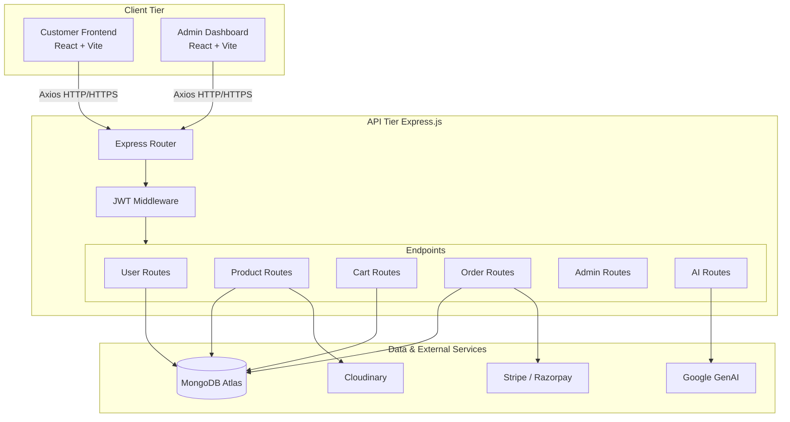

# 🛒 AI-Powered Voice Assistant E-Commerce Platform

An AI-powered **MERN stack e-commerce platform** with an intelligent voice assistant that enables users to search products, navigate the website, and shop hands-free using natural voice commands.

## 🚀 Key Features

* 🎙️ **AI Voice Assistant** – Voice-based interaction for product search, website navigation, and hands-free shopping.
* 🛍️ **Voice Product Search** – Search for products using natural voice commands.
* 🧭 **Voice Website Navigation** – Navigate different sections of the e-commerce platform using voice.
* 🤖 **AI Product Recommendations** – Uses Google Gemini API to provide intelligent and context-aware product recommendations.
* 🗣️ **Speech-to-Text & Text-to-Speech** – Enables natural two-way voice interaction between the user and AI assistant.
* 🔐 **JWT Authentication** – Secure user authentication and authorization.
* 🛒 **Cart Management** – Add, remove, and manage products in the shopping cart.
* 🔌 **RESTful APIs** – Backend APIs for authentication, products, search, and cart operations.
* 💬 **AI Customer Support** – AI-powered assistance for answering customer queries.

## 🛠️ Tech Stack

**Frontend**

* React.js
* JavaScript
* HTML5
* CSS3

**Backend**

* Node.js
* Express.js
* REST APIs

**Database**

* MongoDB

**Authentication**

* JWT (JSON Web Token)

**AI & Voice**

* Google Gemini API
* Speech-to-Text
* Text-to-Speech

## 🏗️ Architecture

```text
User Voice Input
       ↓
Speech-to-Text
       ↓
AI Voice Assistant
       ↓
Gemini API
       ↓
Intent / Product Processing
       ↓
REST API
       ↓
Node.js + Express.js
       ↓
MongoDB
       ↓
Response
       ↓
Text-to-Speech
       ↓
User
```

## 🎯 Project Highlights

* Developed a complete **AI-integrated MERN e-commerce application**.
* Integrated **Gemini API** for intelligent conversational assistance.
* Implemented **voice-controlled product search and website navigation**.
* Built secure REST APIs using **Node.js, Express.js, MongoDB, and JWT**.
* Added **Speech-to-Text and Text-to-Speech** capabilities for hands-free interaction.
* Designed the system to provide a more accessible and interactive shopping experience.

## 🔮 Future Enhancements

* Multilingual voice support
* Personalized recommendations based on user behavior
* Voice-controlled checkout
* Order tracking through voice commands
* Improved conversational memory
* AI-based customer support automation


---

## 🏗️ System Architecture

The project utilizes a decoupled architecture where both React single-page applications independently communicate with the Express.js backend via JSON REST APIs.



---

## 📂 Detailed Subsystem Breakdown

### 1. Backend API (`/backend`)
The backend is a Node.js/Express application acting as the source of truth for all business logic.

**Tech Stack:** Express.js, Mongoose, JWT, bcrypt, Multer, Cloudinary, Stripe, Razorpay, Google GenAI.

**Core API Routes:**
- **`/api/user`**: Registration, authentication, and profile management for customers.
- **`/api/admin`**: Secured endpoints for admin authentication.
- **`/api/product`**: CRUD operations for inventory items. Includes integration with Cloudinary via Multer for image hosting.
- **`/api/cart`**: Manages the user's shopping cart state.
- **`/api/order`**: Checkout sessions, webhook handling for Stripe/Razorpay, and status tracking.
- **`/api/ai`**: Integrates with Google's GenAI model.

**Database Schemas (MongoDB via Mongoose):**
- **User Schema**: `name`, `email`, `password` (hashed), `cartData` (JSON object).
- **Product Schema**: `_id`, `name`, `description`, `price`, `image` (array of Cloudinary URLs), `category`, `subCategory`, `sizes`, `bestseller`, `date`.
- **Order Schema**: `userId`, `items` (array), `amount`, `address`, `status` (default: "Order Placed"), `paymentMethod`, `payment` (boolean), `currency`, and various transaction/razorpay IDs.

---

### 2. Customer Frontend (`/frontend`)
A responsive, dynamic storefront designed for the end-user.

**Tech Stack:** React 19, Vite, Tailwind CSS, React Router DOM, Axios, React Toastify.

**Key Features:**
- Dynamic product listing with category/subcategory filtering.
- Persistent shopping cart (synced with the backend database for logged-in users).
- Secure checkout flow integrated with Stripe and Razorpay.
- Toast notifications for asynchronous actions (e.g., adding to cart, successful login).

---

### 3. Admin Dashboard (`/Admin`)
A restricted-access control panel exclusively for store administrators.

**Tech Stack:** React 19, Vite, Tailwind CSS, React Router DOM, Axios, React Toastify.

**Key Features:**
- **Inventory Management**: Add new products, upload multi-image arrays (sent to backend & Cloudinary), set pricing and size variants.
- **Order Fulfillment**: View all incoming orders, track customer addresses, and update order statuses (e.g., "Packed", "Shipped", "Delivered").

---

## 🚀 Deployment & Running Locally

### Prerequisites
1. Node.js (v18 or higher)
2. MongoDB Atlas Cluster or local MongoDB server
3. API Keys for Cloudinary, Stripe, Razorpay, and Google GenAI

### Step 1: Environment Variables Setup
You must create `.env` files in all three root folders.

**`backend/.env`**
```env
PORT=4000
MONGODB_URI=mongodb+srv://<username>:<password>@cluster.mongodb.net/ecommerce
JWT_SECRET=your_super_secret_key
CLOUDINARY_NAME=your_cloudinary_name
CLOUDINARY_API_KEY=your_cloudinary_key
CLOUDINARY_SECRET_KEY=your_cloudinary_secret
STRIPE_SECRET_KEY=your_stripe_secret
RAZORPAY_KEY_ID=your_razorpay_key_id
RAZORPAY_KEY_SECRET=your_razorpay_secret
GEMINI_API_KEY=your_google_genai_key
```

**`frontend/.env` and `Admin/.env`**
```env
VITE_BACKEND_URL=http://localhost:4000
```

### Step 2: Start the Servers
Open three separate terminal windows.

**Terminal 1: Backend**
```bash
cd backend
npm install
npm run dev
# Server will run on http://localhost:4000
```

**Terminal 2: Frontend**
```bash
cd frontend
npm install
npm run dev
# App will run on http://localhost:5173
```

**Terminal 3: Admin**
```bash
cd Admin
npm install
npm run dev
# Dashboard will run on http://localhost:5174
```
